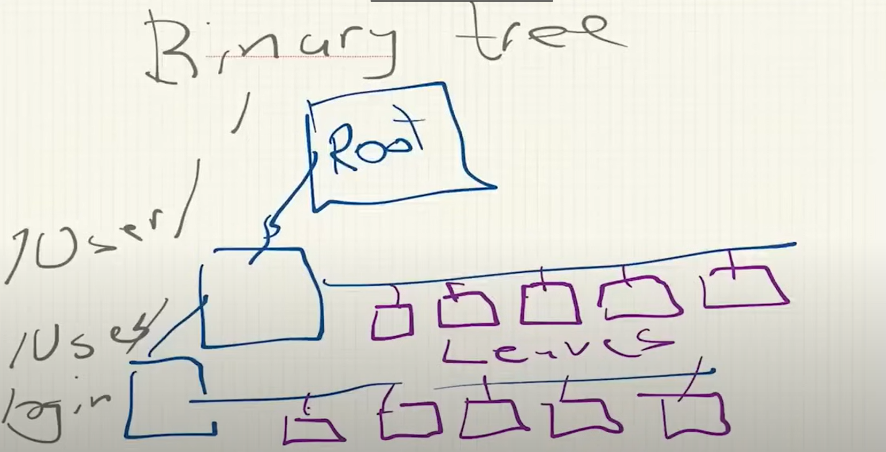

# Read Me
## To Do

### Binary tree

The binary tree here will be Dr. Jonas' own implementation. May not be the traditional binary tree (to be seen). Some key charateristics are the `node` and the `leaf`, and behavior of tree traversing via the *left* side. The left side will be populated with nodes with leaves extending right and outwards. Nodes represent paths (like a filesystem folder), and the leaves representing the objects within the folder.

- [ ] Implement a node (`s_tree`)
  - [ ] Traverse `Up`
  - [ ] Traverse `Down`
  - [ ] Traverse `Right` (to `s_leaf`)
  - [ ] `Tag` - helps define what kind of structure is being used (differentiator between `leaf` and `node`, to be seen if actually necessary)
- [ ] Implement a leaf (`s_leaf`)
  - [ ] Traverse `Left` to identify the node it belongs to
  - [ ] `char key`
  - [ ] `char *value` address of value/object
  - [ ] `int count` - we need to know how many characters the value holds. Since we only carry the pointer, we also need to know the length of the value to get the full value
  - [ ] `Tag` - same purpose from `s_tree`
- [ ] Implement a `u_tree`
  - the `u_tree` (a union), will hold the definitions for both the structs of a node and a leaf, but never defines both at the same time (can only instantiate one or the other) (to save memory)

