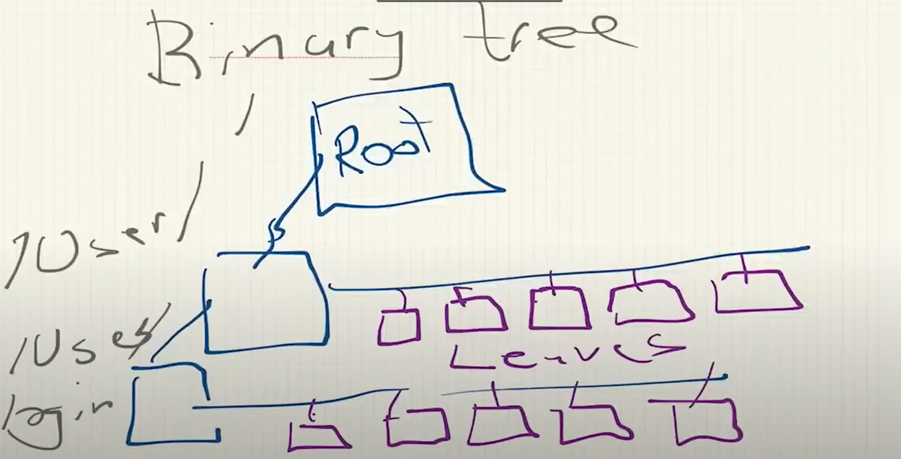

# To Do

## Binary tree

The binary tree here will be Dr. Jonas' own implementation. May not be the traditional binary tree (to be seen). Some key charateristics are the `node` and the `leaf`, and behavior of tree traversing via the *left* side. The left side will be populated with nodes with leaves extending right and outwards. Nodes represent paths (like a filesystem folder), and the leaves representing the objects within the folder.

- [ ] Implement a node
- [ ] Implement a leaf

